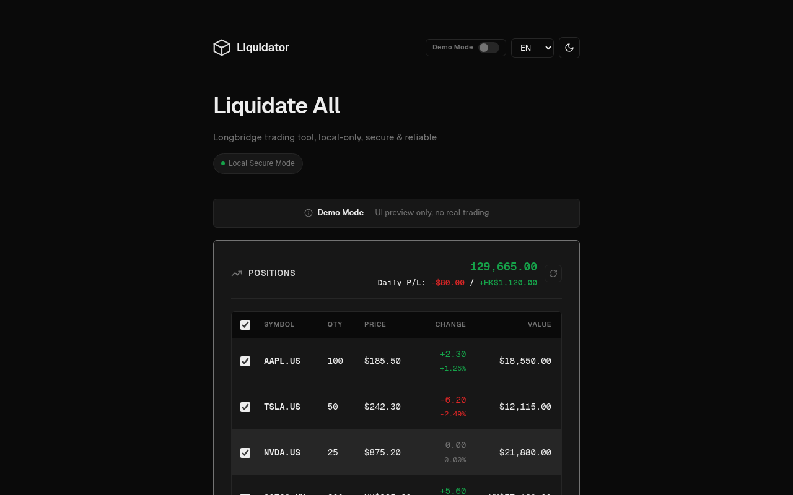
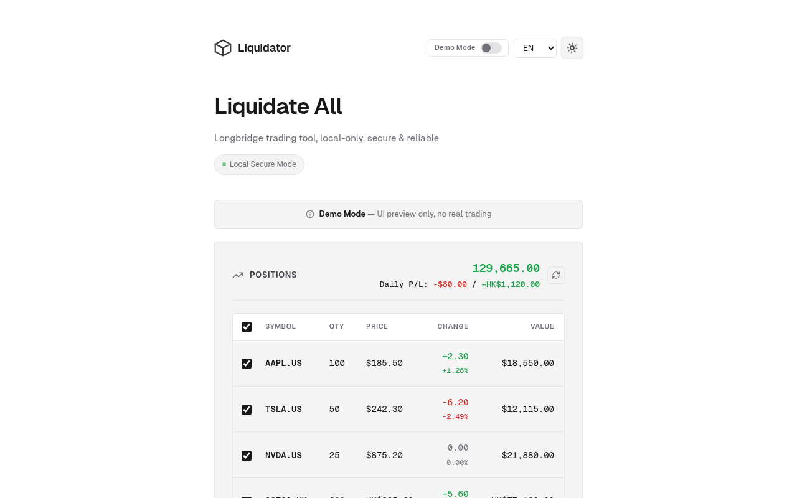
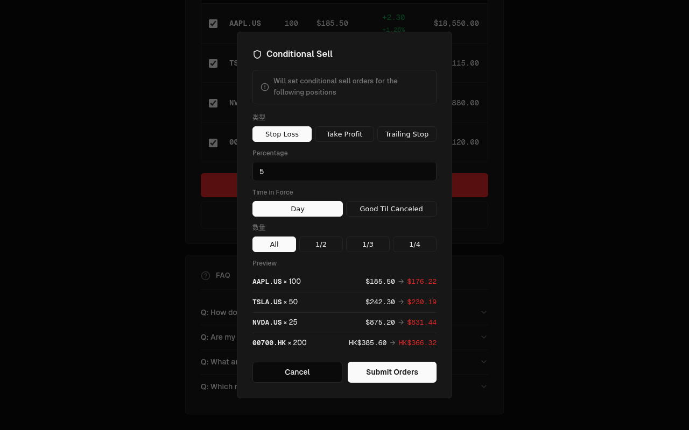
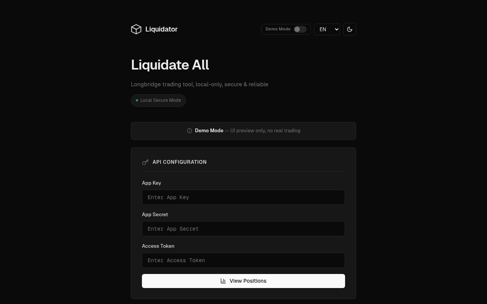

# LB Liquidator

> 长桥一键清仓工具 — 本地安全运行，支持 Web 与 Mac 原生应用
>
> One-click position liquidation tool for Longbridge — local-only, secure. Runs as a web app or native Mac app.


---

## Screenshots

| Dark Mode | Light Mode |
|-----------|------------|
|  |  |

| Conditional Sell | API Setup |
|-----------------|-----------|
|  |  |

---

## Live Demo

**Online Demo:** https://lp-liquidator.echan.work

> ⚠️ Demo Mode only (mock data) — no real trading. The online version is a static deployment with no backend server.

---

## Features

- **Local-only** — API credentials stored in browser localStorage only, server binds to 127.0.0.1
- **Mac native app** — Tauri v2 wrapper, double-click to launch, no terminal needed
- **Auto-updates** — Sparkle-powered, checks for updates on launch + manual check via menu
- **Selective liquidation** — choose positions, sell at full / ½ / ⅓ / ¼ ratio
- **Conditional sell** — batch set take-profit, stop-loss, or trailing stop orders
- **Live positions** — real-time quotes, multi-currency (USD / HKD / SGD), daily P/L
- **i18n** — 简体中文 · 繁體中文 · English
- **Demo mode** — full UI preview without a real account

---

## Tech Stack

| Layer | Technology |
|-------|------------|
| Backend | Node.js + Express |
| Frontend | Vanilla HTML / CSS / JS |
| Mac App | [Tauri v2](https://tauri.app/) (Rust + WKWebView) |
| Auto-update | [tauri-plugin-updater](https://github.com/tauri-apps/plugins-workspace) (Sparkle on macOS) |
| Trading SDK | [Longbridge OpenAPI Node.js SDK](https://www.npmjs.com/package/longport) |
| Icons | [Lucide](https://lucide.dev/) |
| Fonts | [Geist](https://vercel.com/font) |

---

## How to Run

### Option 1: Mac App (Recommended)

Double-click to open — no terminal needed. The server starts automatically in the background.

**Prerequisites (one-time):**

```bash
# Install Rust
curl --proto '=https' --tlsv1.2 -sSf https://sh.rustup.rs | sh
source ~/.cargo/env
```

**Build:**

```bash
git clone https://github.com/therealechan/longbridge-liquidator-web.git
cd longbridge-liquidator-web

npm install
npx tauri build
```

Output:
```
src-tauri/target/release/bundle/macos/LB Liquidator.app
src-tauri/target/release/bundle/dmg/LB Liquidator_x.x.x_aarch64.dmg
```

> First build takes ~3–5 min (Rust compiling deps). Subsequent builds are fast.

**Dev mode (faster iteration):**

```bash
# Terminal 1
npm run dev

# Terminal 2
npx tauri dev
```

---

### Option 2: Web Mode

```bash
git clone https://github.com/therealechan/longbridge-liquidator-web.git
cd longbridge-liquidator-web
npm install
npm start
# → http://127.0.0.1:3456
```

---

## Releases

Download the latest `.dmg` from the [Releases page](https://github.com/therealechan/longbridge-liquidator-web/releases).

The app updates itself automatically — on launch it checks for newer versions and prompts you to install. You can also trigger it manually via **LB Liquidator → Check for Updates…** in the menu bar.

---

## API Configuration

| Credential | Description |
|---|---|
| App Key | Application identifier |
| App Secret | Application secret |
| Access Token | API access token |

Get credentials from [Longbridge Developer Center](https://open.longportapp.com/) → User Center → App Credentials.

> 📖 Docs: https://open.longportapp.com/docs

---

## Usage

1. Enter your Longbridge API credentials
2. Click **View Positions** to load your current holdings
3. Select positions to operate on (all selected by default)
4. Choose an action:
   - **Liquidate** — market sell selected positions at full / ½ / ⅓ / ¼
   - **Buy Back** — market buy back previously liquidated positions
   - **Conditional Sell** — batch set take-profit / stop-loss / trailing stop orders

---

## Security

- API credentials stored in browser localStorage — never leave your machine
- Server binds to `127.0.0.1` only — not accessible from the network
- Mac App embeds the server inside the `.app` bundle — zero network exposure
- Open source — audit the code yourself

---

## Disclaimer

**本工具仅供学习交流，投资有风险，操作需谨慎。**

This tool is for educational purposes only. Trading involves risk; proceed with caution.

---

## License

[MIT](LICENSE) © [Ed](https://github.com/therealechan)
